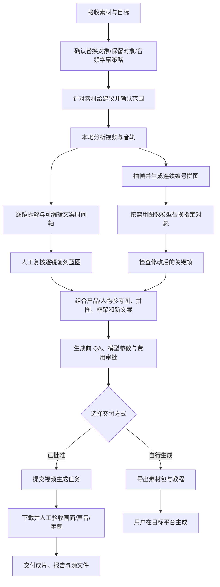

# 短视频复刻与多智能体协作工具箱

面向短视频创作者与制作团队的本地优先工作流：先确认改动范围，再拆解视频、整理逐镜复刻蓝图、制作连续编号关键帧拼图、准备可编辑文案，最后按需调用图像/视频 API 或导出手动生成包。

> 仓库只提供工具、skill、模板和教程，不包含真实客户素材、视频、生成结果或 API 密钥。默认将原视频留在本机分析；任何付费生成都应先审核模型、素材、时长、分辨率和费用。

## 能做什么

- 中文多智能体分工：总导演、视频拆解师、深度拆解师、关键帧拼图师、文案导演、复刻策划师、提示词导演、质量验收官、生成执行师和交付打包师。
- 本地解析视频元数据、镜头、音轨和语音转写，输出结构化 evidence、逐镜框架与可修改文案时间轴。
- 每秒抽帧，按时间顺序拼成 3 联或 6 联图，并用全局连续 `Shot 01...` 编号；支持以拼图和产品图作为外部生成参考，而不上传原视频。
- 明确替换产品、人物、场景等对象及需要保留的内容；提示词将逐镜蓝图、参考图与新文案一起提交，降低生成模型自由改编。
- 连接 New API 视频 provider / Hypit 做检查、计划、计价、dry-run 和经批准的真实生成；也可导出 ZIP 手动生成包及中文教程。
- 验收生成视频的画面、连续性、音轨、字幕、分辨率和时长，不以 API 的 `completed` 状态代替成片检查。

## 流程图



## 快速开始

### 环境要求

- Windows 10/11 与 PowerShell。
- Python 3.10+、Node.js/npm、FFmpeg。
- 可选：Chrome（生成同步复核视频）、Whisper（语音转写）、Gemini API（用户明确允许外部分析时）。
- 需要真实调用第三方视频 API 时，再配置自己的授权凭据。凭据不能写入仓库。

### 安装

```powershell
git clone <本仓库地址>
cd short-video-product-swap-team
py -3.12 -m pip install -e .
npm install
npm --prefix .\packages\provider-newapi-video install
npm --prefix .\packages\provider-newapi-video run build
```

项目要求 Python `>=3.10`。Windows 上若 `python` 指向旧版本，统一使用 `py -3.12`；也可以运行初始化脚本完成同样的检查和安装：

```powershell
powershell -ExecutionPolicy Bypass -File .\scripts\init-workspace.ps1 -InstallNodeDependencies -InstallPython
```

先运行诊断，不发起付费生成：

```powershell
powershell -ExecutionPolicy Bypass -File .\scripts\diagnose-workspace.ps1 -SkipNetwork
```

### 新建项目并本地拆解

将自己的参考视频和产品图放在本机项目目录，例如：

```text
projects/my-campaign/inputs/reference.mp4
projects/my-campaign/inputs/product_refs/product-front.png
```

项目素材目录已加入 `.gitignore`，不要强行 `git add -f` 上传。

先运行团队工作流。新素材进入流程时，先确认“替换产品/人物/场景/文案等哪一项”、哪些内容必须保留、音频与字幕策略、是否上传参考视频和输出参数；收到确认后再拆解：

```powershell
powershell -ExecutionPolicy Bypass -File .\scripts\run-video-team.ps1 -Project projects/my-campaign
```

该入口默认执行本地分析、关键帧、提示词、QA 和素材包准备。命令参数以 `-Help`/脚本说明为准。CLI 也可分步使用：

```powershell
py -3.12 -m video_replicator.cli analyze .\projects\my-campaign\inputs\reference.mp4 --project .\projects\my-campaign
py -3.12 -m video_replicator.cli keyframes --project .\projects\my-campaign --frames-per-sheet 6
py -3.12 -m video_replicator.cli plan .\projects\my-campaign\analysis\evidence.json --project .\projects\my-campaign --segment-max 15
py -3.12 -m video_replicator.cli prompts .\projects\my-campaign\analysis\plan.json --project .\projects\my-campaign
```

运行前查看 CLI 参数：

```powershell
py -3.12 -m video_replicator.cli --help
```

需要把模型生成的静音视频与改写文案时间轴合成为本地配音时，可使用参数化脚本：

```powershell
py -3.12 .\scripts\build_exact_voiceover.py `
  --project .\projects\my-campaign `
  --video .\projects\my-campaign\outputs\newapi\generated.mp4 `
  --timeline .\projects\my-campaign\analysis\script-timeline.json
```

复核逐镜蓝图与新文案。若要改对白/字幕，编辑项目 `analysis/` 中对应 timeline/script 产物，并再次 QA。字幕不必沿用参考视频里的字幕，可明确要求清除或按新文案生成。若要真实生成，必须提供人工审核后的 `analysis/replication-framework.json`；入口会编译成 `outputs/final_product_swap_prompt.md`，缺失或 QA 未通过时会阻止提交。

### 关键帧编辑建议

若只换产品：用图像模型编辑单张原始帧，六联拼图仅作为前后场景/动作/构图上下文，产品正面参考图作为外观依据；先验收一张代表帧，再处理其余帧。人物或场景替换也遵循相同原则：单帧为底图、拼图作连续性参考、指定参考图锁定替换对象。不要把拼图当作最终视频的分屏布局。

### API 配置与安全

New API Python 客户端读取环境变量，或读取用户本机 `$HOME\.codex\secrets\newapi.env`：

```env
NEW_API_URL=https://your-provider.example
NEW_API_TOKEN=在本机填写，不要提交
NEW_API_MODEL=your-model-id
```

Gemini（可选）使用 `GEMINI_API_KEY` 环境变量。不要将密钥放进命令行历史、脚本、`hypit.runtime.json`、请求响应文件或截图。曾经公开/聊天暴露的凭据应先在服务商后台撤销并轮换。

### Dry-run 与真实生成

默认先 dry-run，检查提示词、参考素材和脱敏请求；Hypit `check`、`plan`、`pricing` 是只读准备步骤。只有在确认替换范围、模型、生成声音/字幕策略、时长、分辨率和费用后，才使用 CLI 的真实提交选项。Python New API 真实提交要求 `outputs/qa.json` 的状态为 `ready`、存在最终逐镜提示词，并且 `outputs/scope-approval.json` 已记录负责人审批。Hypit provider 当前只支持静音链路；需要模型原生音频时不要走 Hypit Build。真实生成可能产生费用，具体命令及 provider 能力以 `py -3.12 -m video_replicator.cli newapi --help` 和 `docs/OPERATIONS.md` 为准。

### 三态门禁与运行清单

每次分析都会在 `projects/<项目>/outputs/run-manifest.json` 写入运行清单，包含输入视频绝对路径、文件大小、修改时间、SHA-256、参数、步骤、产物路径和 QA 状态。视频内容不上传到仓库。

- `blocked`：存在缺失输入、占位镜头、分段超限或其他阻断项，必须修复后重跑。
- `review_required`：确定性检查已完成，但仍需要负责人审核范围、文案、音频/字幕策略或其他风险；不得提交付费生成。
- `ready`：审核文件有效且没有阻断项，可以在费用确认后进入 provider 提交。

人工审核文件示例（保存为项目的 `outputs/scope-approval.json`）：

```json
{
  "status": "approved",
  "reviewer": "负责人姓名",
  "approved_at": "2026-09-24T12:00:00+08:00",
  "notes": "确认替换对象、保留人物与构图、音频和字幕策略"
}
```

生成时应一并提供：

1. 修改后的编号关键帧拼图；
2. 替换产品/人物等对象的参考图；
3. 拆解和人工优化后的逐镜复刻框架；
4. 按时间段映射的新口播文案及原生音频要求；
5. 明确禁止改变项和字幕/水印要求。

### 手动生成包与成片验收

```powershell
powershell -ExecutionPolicy Bypass -File .\scripts\export-manual-generation-package.ps1 -Project projects/my-campaign
```

将输出的 ZIP、参数与中文教程交给目标平台操作员。直接生成时，人工检查人物/场景、产品外观、逐镜动作、口播准确度、音轨是否存在、字幕/水印和视频规格，并记录结果。

## 智能体与 Skill

- 团队定义：[`config/video-replication-agents.zh-CN.json`](config/video-replication-agents.zh-CN.json)
- 可分发 Codex Skill：[`skills/short-video-product-swap-team/SKILL.md`](skills/short-video-product-swap-team/SKILL.md)
- 团队角色说明：[`docs/多智能体团队说明.md`](docs/多智能体团队说明.md)
- 同事接手教程：[`docs/发给Codex的接手说明.md`](docs/发给Codex的接手说明.md)
- 安装/运维/故障排查：[`docs/OPERATIONS.md`](docs/OPERATIONS.md)
- API provider：[`packages/provider-newapi-video`](packages/provider-newapi-video)

本仓库只分发本项目维护的 Skill。Gemini、Whisper、Hypit、图像生成等第三方 Skill/服务需从其原始发行方单独安装或配置，并遵循各自许可证与条款；不复制第三方密钥或私有文件。

## 测试

```powershell
py -3.12 -m unittest discover -s tests -v
npm --prefix .\packages\provider-newapi-video run build
py -3.12 -m video_replicator.cli --help
```

## 隐私与安全

- 仓库为工具和文档，不是媒体素材云盘。项目输入、逐帧图、音频、第三方上传文件、API 响应、生成视频和 Hypit 状态都属于本地/任务数据，不应提交。
- `.gitignore` 默认忽略 `.env`、运行时密钥配置、`projects/*/inputs`、分析与输出、媒体文件、`.hypit/`、虚拟环境、依赖与构建产物。
- 在推送前检查 Git 暂存区和历史。如发现密钥，立即停止推送并撤销轮换；删除工作树文件不能抹除已推送的 Git 历史。
- 参考视频只在本机分析，除非用户明确授权某个外部分析服务接收该视频。

## 许可证

尚未添加开源许可证前，本仓库内容默认为保留所有权利。发布为私有仓库供团队协作使用；公开分发前应确认第三方依赖、Skill 与素材的许可证。
