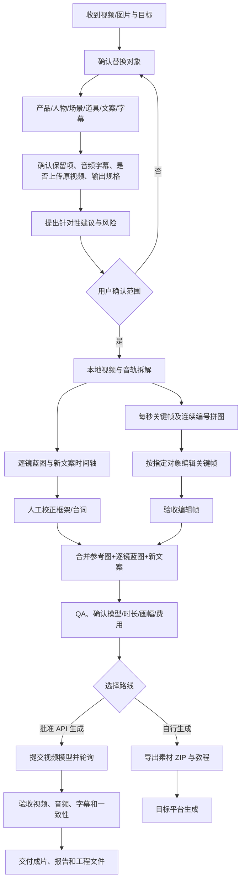

# 流程图与操作教程

## 从需求到交付



## 推荐操作顺序

1. **说清替换目标**：例如“只替换酒瓶，保留人物、手部、动作、镜头和背景”。如果要替换人物或场景，明确不能改动的其他对象。
2. **确认声音和字幕**：原音是否保留，视频模型是否直接生成音频，原字幕是否删除，是否使用改写后的字幕/口播。
3. **先本地拆解**：提取视频时长、镜头、每秒帧、音轨与语音；对白必须来自音轨转写，不根据画面猜。
4. **编辑结构化结果**：按镜头检查时间、动作、景别、运镜、主体位置、产品状态和转场；改写文案需逐段映射到时间轴。
5. **改关键帧**：六联/三联图帮助图像模型理解相邻帧连续性；图像编辑应以单张原始帧为底图，避免把拼图误当成最终画面。先验收一帧，再批量处理。
6. **准备生成输入**：同一请求中同时放入修改后的拼图、目标对象参考图、逐镜框架和改写口播。明确提示拼图编号只表达时间顺序，禁止字幕/促销字等不需要的元素。
7. **先 dry-run 和计价**：确认模型 ID、时长、分辨率、画幅、参考素材数量、是否生成音频及预计费用。未经用户批准不得发起付费请求。
8. **验收和交付**：逐段看成片，对照蓝图检查主体、动作、构图、标签、音轨、口播、字幕和时长；失败或偏差要如实记录。

## 本地命令

```powershell
python -m video_replicator.cli analyze .\projects\my-campaign\inputs\reference.mp4 --project .\projects\my-campaign
python -m video_replicator.cli keyframes --project .\projects\my-campaign --frames-per-sheet 6
python -m video_replicator.cli plan .\projects\my-campaign\analysis\evidence.json --project .\projects\my-campaign --segment-max 15
python -m video_replicator.cli deep-analyze --project .\projects\my-campaign
python -m video_replicator.cli script-timeline --project .\projects\my-campaign
python -m video_replicator.cli --help
```

第三方 provider 与真实生成选项请查看 [`OPERATIONS.md`](OPERATIONS.md)。真实生成必须经单独审批。
